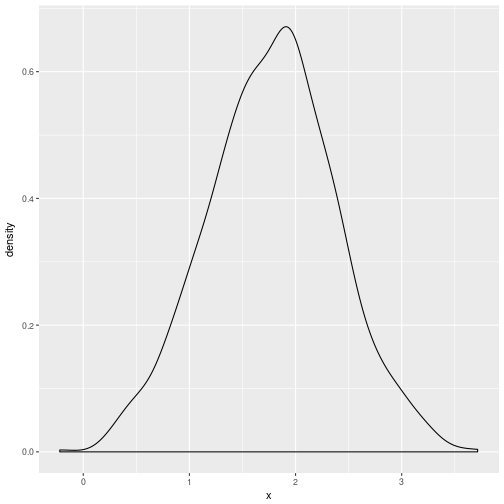

Capítulo 5: Comparação de dois grupos
========================================================
author: 
date: 
autosize: true


Inferências baseadas em percentis pelo método de bootstrap
========================================================
- Comparar dois grupos por uma característica de interesse $\theta_{j}$;

- Isto pode ser feito por: $H_{0}: \theta_{1} = \theta_{2}$

- Como comparar?

Estratégia
========================================================
- Amostras por bootstrap de cada grupo (j = $1, 2$);

- Determinar a estimativa $\hat{\theta_{j}^{*}}$ de $\theta_{j}$, j = $1, 2$, para cada reamostragem (B);

- Obter as diferenças: $D^{*} = \hat{\theta_{1}^{*}} - \hat{\theta_{2}^{*}}$, (B diferenças);

Estratégia (continuação)
========================================================
- Define-se: $l = \frac{\alpha}{2} B$ e $u = B - l$;

- Assim, um I.C. por bootstrap é: $[D_{(l+1)}^{*}, D_{(u)}^{*}]$, tal que $D_{(1)}^{*} \le \dots \le D_{(B)}^{*}$;

Sob a hipótese de igualdade das características
========================================================
- Para as estimativas $\hat{\theta_{1}^{*}}$ e $\hat{\theta_{2}^{*}}$, seja $p^{*} = P(\hat{\theta_{1}^{*}} > \hat{\theta_{2}^{*}})$;

- Assintoticamente (n,B), $p^{*}$ é aproximadamente uniforme. Assim, se $p^{*} \le \frac{\alpha}{2}$  ou  $p^{*} \ge 1 -\frac{\alpha}{2}$ rejeita-se $H_{0}$;

- $p^{*}$ é estimado por: $p^{*} = \frac{A}{B}$;

- Por conveniência, define-se $\hat{p_{m}}^{*} = \min(p^{*}, 1 - p^{*})$; caso $2\hat{p_{m}}^{*} \le \alpha$, então rejeita-se $H_{0}$;


Comparação de M-estimadores de locação
========================================================
- Inferência baseada no método de percentil via bootstrap ainda é o melhor método;

- I.C., baseado no erro padrão do M-estimador, terá boa probabilidade de cobertura quando:
  
  - tamanho amostral é suficientemente grande;
  
  - assumir que as diferenças estimadas são normalmente distribuídas;

- Problemas: distribuição amostral é assimétrica;

Comparação de médias aparadas
========================================================
- "Apara" $\ge$ 20%, a inferência baseada nos percentis de bootstrap ainda é razoável;

- Para pequenas "aparas", melhor a precisão de outro método;
  
    - Incerteza do quão pequena é a "apara";
    - De acordo com Keselman et al. razoável para 10% - 15% de "apara";

Observações dos diferentes métodos
========================================================
- $n_{1} = 40$, amostra de uma população normal padrão;
- $n_{2} = 20$, amostra de uma população lognormal;

- Com $\alpha = 0.05$ e 10% de "apara":
  - $\alpha$ para  outro método $= 0,066$; 
  - $\alpha$ para método percentil bootstrap $= 0,050$; 
  
- $n_{1} = 20$, $n_{2} = 10$: 
    - $\alpha$ para outro método $= 0,082$; 
    - $\alpha$ para método percentil bootstrap $= 0,074$; 

Observações dos diferentes métodos (continuação)
========================================================
- $n_{1} = 20$, $n_{2} = 10$, $\alpha = 0.05$ e 20% de "apara": 
  - $\alpha$ para outro método $= 0,081$; 
  - $\alpha$ para método percentil bootstrap $= 0,063$; 
  
- Em geral, ao fazer inferência com base nos percentis do método de bootstrap melhora o controle sobre o erro do tipo 1.  
  
Exemplo1: horas de exercícios por semana para sexo
========================================================


```
  F   M 
169 193 
```

```
Gender: F
[1] 8.110119
-------------------------------------------------------- 
Gender: M
[1] 9.875648
```

Exemplo1 (continuação)
========================================================


```
[1] 0.5612155 2.9698418
```
